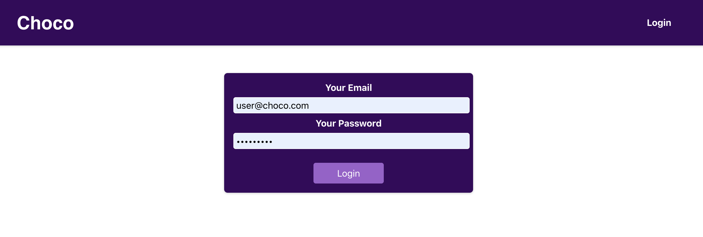

# React Login Form - Typescript

## Description

Login app is a simple login form built using React, Typescript and React Material UI. 

## Available Scripts

In the project directory, you can run:

### `npm install`

Installs the dependencies defined in the `package.json` file
### `npm start`

Runs the app in the development mode. 
Open [http://localhost:3000](http://localhost:3000) to view it in the browser.

## Technologies involved / approach
- Login/Cart functionality is using Typescript, Material UI, Styled Components and React-Query.
- React-Query hooks is used for fetching the data from the API.
- Responsive web design 
- Styled Components for cleaner code.

## Further improvements

- Increase test coverage (>80%)
- Include Web accessibility standards
- Improve the component structure.

